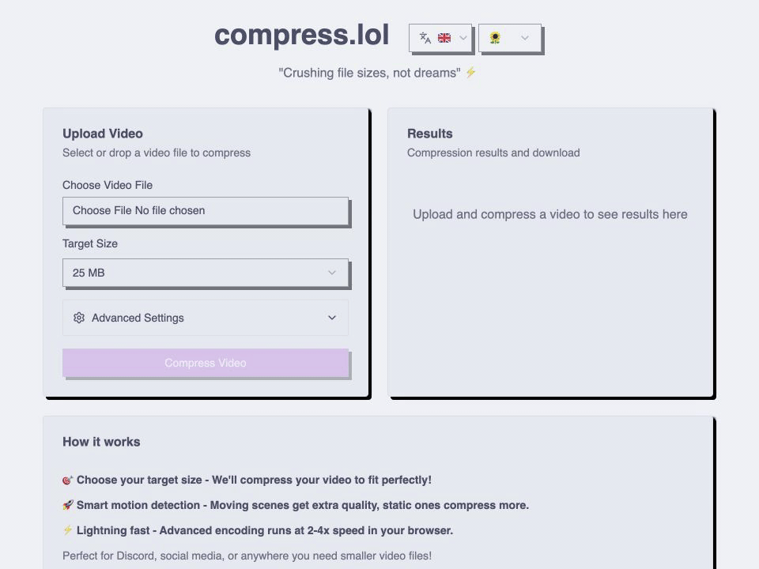

<h1 align="center">
  <picture>
    <source media="(prefers-color-scheme: dark)" srcset=".github/assets/header-dark.svg">
    
  </picture>
</h1>

<p align="center">
  Shrink any video to fit Discord, WhatsApp or email, 100% in your browser with WebCodecs and WebAssembly. Nothing is uploaded.
</p>

<p align="center">
  <a href="LICENSE"></a>
  <a href="https://github.com/sowahq/compress.lol/stargazers"></a>
  <a href="https://compress.lol"></a>
</p>

<p align="center">
  
</p>

## Features

- **Private by design**: the video is read and encoded on your device. No server upload, no account.
- **Fast**: WebCodecs uses the hardware encoder of your GPU. ffmpeg.wasm takes over for formats and browsers WebCodecs cannot handle (AVI, MPEG-4 Part 2...).
- **Hits the target**: the output is measured and re-encoded with a corrected budget when it is too large, so it lands under the size you picked.
- **Platform presets**: Discord, Discord Nitro, WhatsApp, Gmail / Outlook, generic sizes, or any custom size from 1 to 2048 MB.
- **Large files**: videos up to 5 GB, in MP4, MOV, MKV, WebM, AVI and more.
- **Options**: drag and drop, trim the start or the end, mute the sound, keep the original frame rate, or keep the audio only.
- **Five languages**: English, French, Polish, Korean and Arabic (right to left), with light, dark and Catppuccin themes.

## Benchmark

Time from clicking "Compress Video" to the download being ready, measured on an Apple M4 MacBook with Chrome 153 (macOS 27), production build, median of two runs.

| Clip                         | Original | Target          | Output  | Reduction | Time   |
| ---------------------------- | -------- | --------------- | ------- | --------- | ------ |
| 4K 30 fps, 24 s              | 148.5 MB | 25 MB           | 22.9 MB | 84.6%     | 2.8 s  |
| 4K 30 fps, 24 s              | 148.5 MB | Discord (20 MB) | 18.2 MB | 87.7%     | 2.8 s  |
| Phone, portrait 60 fps, 44 s | 125.6 MB | 25 MB           | 23.3 MB | 81.5%     | 4.3 s  |
| Phone, portrait 60 fps, 44 s | 125.6 MB | Discord (20 MB) | 18.7 MB | 85.1%     | 4.3 s  |
| 1080p film, 60 s             | 52.6 MB  | 25 MB           | 23.3 MB | 55.6%     | 4.3 s  |
| 1080p film, 60 s             | 52.6 MB  | Discord (20 MB) | 18.7 MB | 64.5%     | 4.3 s  |
| 1080p film, 2 min 30 s       | 170.2 MB | 25 MB           | 23.3 MB | 86.3%     | 10.6 s |
| 1080p film, 2 min 30 s       | 170.2 MB | Discord (20 MB) | 18.7 MB | 89.0%     | 10.6 s |
| 1080p film, 2 min 30 s       | 170.2 MB | 8 MB            | 7.5 MB  | 95.6%     | 10.9 s |

Every run used WebCodecs and met the target on the first attempt. Resolution and frame rate drop when the target requires it: the 4K clip comes out at 1440x810, the portrait clip at 810x1440 and 30 fps.

Clips: [Volcano eruption of Litli-Hrútur](https://commons.wikimedia.org/wiki/File:007_Volcano_eruption_of_Litli-Hr%C3%BAtur_in_Iceland_in_2023_Video_by_Giles_Laurent.webm) by Giles Laurent (CC BY-SA 4.0), [VTA light rail arriving at Hamilton station](https://commons.wikimedia.org/wiki/File:VTA_light_rail_arriving_at_Hamilton_station.webm) by Grendelkhan (CC BY-SA 4.0), [Tears of Steel](https://mango.blender.org) and [Sintel](https://durian.blender.org) by the Blender Foundation (CC BY 3.0), re-encoded to H.264 at camera-like bitrates before the test.

## Self-Hosting

The image runs on amd64 and arm64 and listens on port 3000.

```bash
docker run -d --name compress -p 3000:3000 --restart unless-stopped ghcr.io/sowahq/compress.lol:latest
```

Or with Docker Compose (`compose.yaml`):

```yaml
services:
  compress:
    image: ghcr.io/sowahq/compress.lol:latest
    ports:
      - '3000:3000'
    restart: unless-stopped
```

- **Serve it over HTTPS** (or open it on `localhost`). Browsers only enable WebCodecs and `SharedArrayBuffer` in a secure context, so a plain `http://` LAN address will not compress anything. Any reverse proxy with a certificate works (Caddy, Traefik, nginx).
- **No analytics**: a self-hosted instance loads no tracking script and sends nothing anywhere.
- **Environment variables**: `PORT` (default `3000`) and `HOST` (default `0.0.0.0`).
- **Build it yourself**: `docker build -t compress.lol .` from a clone of this repository.

## How it works

1. **Analysis**: [Mediabunny](https://mediabunny.dev) reads the file (duration, resolution, frame rate, codec, rotation). Files it cannot read are probed with ffmpeg.wasm.
2. **Settings**: resolution, frame rate and bitrates are derived from the target size, the duration and how much motion the video has. Targets too small for the duration are refused before encoding.
3. **Encoding**: WebCodecs encodes H.264 and AAC into an MP4. If WebCodecs cannot handle the file, fails or stalls, the same attempt runs with ffmpeg.wasm, loaded on demand from jsDelivr (unpkg as fallback) and checked against pinned SHA-256 hashes.
4. **Fit check**: an output over the target is re-encoded with a corrected budget, up to three attempts.

The flow lives in `src/lib/compression/`, starting with `compressor.ts`. All sizes are decimal megabytes (1 MB = 1,000,000 bytes), the unit platforms use. Presets live in `src/lib/compression/presets.json`, each with its official source and the date it was checked.

### Browser support

- **WebCodecs (fast path)**: Chrome and Edge 94+, Safari 16.4+, Firefox 130+. Audio is always encoded with a WebAssembly AAC encoder, because native AAC encoders ignore or reject low bitrates.
- **Fallback**: any browser with WebAssembly and `SharedArrayBuffer`. The app sends the cross-origin isolation headers this requires.

### Privacy

Videos are never uploaded: analysis and encoding run in your browser. compress.lol counts anonymous usage events with [Umami](https://umami.is) (no cookies): for example the resolution tier, size and duration ranges, file extension, chosen target, engine used and whether the target was met. File names and contents are never sent.

## Contributing

Contributions are welcome: bug reports, new platform presets, translations and code. Read [CONTRIBUTING.md](CONTRIBUTING.md) for the setup, the checks to run and the pull request conventions, and [Translations](CONTRIBUTING.md#translations) to add a language. This project follows a [code of conduct](CODE_OF_CONDUCT.md).

```bash
npm ci             # install dependencies
npm run dev        # development server on http://localhost:5173
npm test           # unit tests
npm run check      # type check
npm run lint       # formatting check (npm run format to fix)
npm run build      # production build
```

Requirements: Node.js 20.9 or later and npm. The `/lab` page, available in development only, compresses the same file with every engine and compares speed, size and target accuracy. compress.lol runs on Cloudflare Workers, and every merge to `main` is deployed by Cloudflare Workers Builds.

## License

compress.lol is open source under the [Apache License 2.0](LICENSE).

## Acknowledgements

- [Mediabunny](https://mediabunny.dev) and its AAC encoder extension: reading, WebCodecs encoding and writing of media files
- [FFmpeg](https://ffmpeg.org) and [ffmpeg.wasm](https://github.com/ffmpegwasm/ffmpeg.wasm): the fallback engine
- [Svelte](https://svelte.dev) and [SvelteKit](https://svelte.dev/docs/kit): application framework
- [Paraglide JS](https://inlang.com/m/gerre34r/library-inlang-paraglideJs): type-safe translations
- [Tailwind CSS](https://tailwindcss.com), [shadcn-svelte](https://www.shadcn-svelte.com) and [Bits UI](https://bits-ui.com): styling and UI components
- [Lucide](https://lucide.dev): icons
- [Catppuccin](https://catppuccin.com): color themes
- [Umami](https://umami.is): privacy-friendly analytics
- [Cloudflare Workers](https://workers.cloudflare.com): hosting
- [jsDelivr](https://www.jsdelivr.com) and [unpkg](https://unpkg.com): delivery of the ffmpeg.wasm core
- [Contributor Covenant](https://www.contributor-covenant.org): code of conduct
