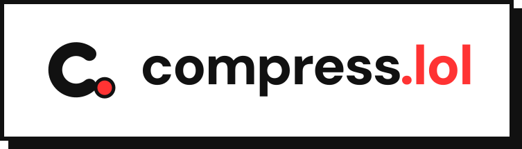

<h1 align="center">
  <picture>
    <source media="(prefers-color-scheme: dark)" srcset=".github/assets/header-dark.svg">
    
  </picture>
</h1>

[](LICENSE)
[](https://github.com/sowahq/compress.lol/issues)
[](https://svelte.dev/docs/kit)
[](https://www.typescriptlang.org/)

> _"Crushing file sizes, not dreams"_

Compress a video to a target size (Discord, WhatsApp, email or any size you choose) directly in your browser at [compress.lol](https://compress.lol). The video never leaves your device.

---

## Features

- **Fits the target**: the output is measured and re-encoded when needed, up to three attempts, so it lands under the size you picked.
- **Platform presets**: Discord, Discord Nitro, WhatsApp, Gmail / Outlook, generic sizes or a custom size.
- **Hardware encoding**: WebCodecs encodes on the GPU when the browser supports it, with an automatic fallback to ffmpeg.wasm for older formats (AVI, MPEG-4 Part 2...) and browsers.
- **Options**: trim the start or the end, mute the sound, keep the original frame rate, or process the audio only without re-encoding the video.
- **Private**: files are read and encoded locally; nothing is uploaded.
- **Five languages**: English, French, Polish, Korean and Arabic (right to left), with light, dark and Catppuccin themes.

---

## How it works

1. **Analysis**: [Mediabunny](https://mediabunny.dev) reads the file (duration, resolution, frame rate, codec, rotation). Files it cannot read are probed with ffmpeg.wasm.
2. **Settings**: resolution, frame rate and bitrates are derived from the target size, the duration and how much motion the video has. Targets too small for the duration are refused before encoding.
3. **Encoding**: WebCodecs encodes H.264 and AAC into an MP4. If WebCodecs cannot handle the file, fails or stalls, the same attempt runs with ffmpeg.wasm, loaded on demand from jsDelivr (unpkg as fallback) and checked against pinned SHA-256 hashes.
4. **Fit check**: an output over the target is re-encoded with a corrected budget.

The flow lives in `src/lib/compression/`, starting with `compressor.ts`.

### Compression targets

All sizes are decimal megabytes (1 MB = 1,000,000 bytes), the unit platforms use. Platform presets:

- **Discord**: 20 MB; **Discord Nitro Basic**: 50 MB; **Discord Nitro**: 500 MB
- **WhatsApp**: 16 MB (largest video sent as media)
- **Gmail / Outlook**: 18 MB (25 MB limit minus attachment encoding overhead)

Generic sizes: **8 MB**, **25 MB** (default), **50 MB**, **100 MB**, or a **custom size** from 1 to 2048 MB. Presets live in `src/lib/compression/presets.json`, each with its official source and the date it was checked.

---

## Browser support

- **WebCodecs (fast path)**: Chrome and Edge 94+, Safari 16.4+, Firefox 130+. Browsers without a native AAC encoder (Firefox) use a WebAssembly AAC encoder.
- **Fallback**: any browser with WebAssembly and `SharedArrayBuffer`. The app sends the cross-origin isolation headers this requires.
- **Maximum file size**: 5 GB.

---

## Privacy

Videos are never uploaded: analysis and encoding run in your browser.

The site counts anonymous usage events with [Umami](https://umami.is) (no cookies): for example the resolution tier, size and duration ranges, file extension, chosen target, engine used and whether the target was met. File names and contents are never sent.

---

## Development

Requirements: Node.js 20.9 or later and npm.

```bash
npm ci             # install dependencies
npm run dev        # development server on http://localhost:5173
npm test           # unit tests
npm run check      # type check
npm run lint       # formatting check (npm run format to fix)
npm run build      # production build
```

The `/lab` page, available in development only, compresses the same file with every engine and compares speed, size and target accuracy.

The site runs on Cloudflare Workers. Every merge to `main` is built and deployed by Cloudflare Workers Builds. `npm run preview:cloudflare` runs the production build locally with Wrangler.

### Adding languages

See [Translations in CONTRIBUTING.md](CONTRIBUTING.md#translations). `npm test` checks that every language has all the texts.

---

## Contributing

Contributions are welcome. Read [CONTRIBUTING.md](CONTRIBUTING.md) for the setup, the checks to run and the pull request conventions. This project follows a [code of conduct](CODE_OF_CONDUCT.md).

---

## License

Apache 2.0, see [LICENSE](LICENSE).

---

## Acknowledgements

- [Mediabunny](https://mediabunny.dev) and its AAC encoder extension: reading, WebCodecs encoding and writing of media files
- [FFmpeg](https://ffmpeg.org) and [ffmpeg.wasm](https://github.com/ffmpegwasm/ffmpeg.wasm): the fallback engine
- [Svelte](https://svelte.dev) and [SvelteKit](https://svelte.dev/docs/kit): application framework
- [Paraglide JS](https://inlang.com/m/gerre34r/library-inlang-paraglideJs): type-safe translations
- [Tailwind CSS](https://tailwindcss.com), [shadcn-svelte](https://www.shadcn-svelte.com) and [Bits UI](https://bits-ui.com): styling and UI components
- [Lucide](https://lucide.dev): icons
- [Catppuccin](https://catppuccin.com): color themes
- [Umami](https://umami.is): privacy-friendly analytics
- [Cloudflare Workers](https://workers.cloudflare.com): hosting
- [jsDelivr](https://www.jsdelivr.com) and [unpkg](https://unpkg.com): delivery of the ffmpeg.wasm core
- [Contributor Covenant](https://www.contributor-covenant.org): code of conduct

---

<div align="center">
    <em>"Making video compression accessible to everyone, one byte at a time"</em>
</div>
